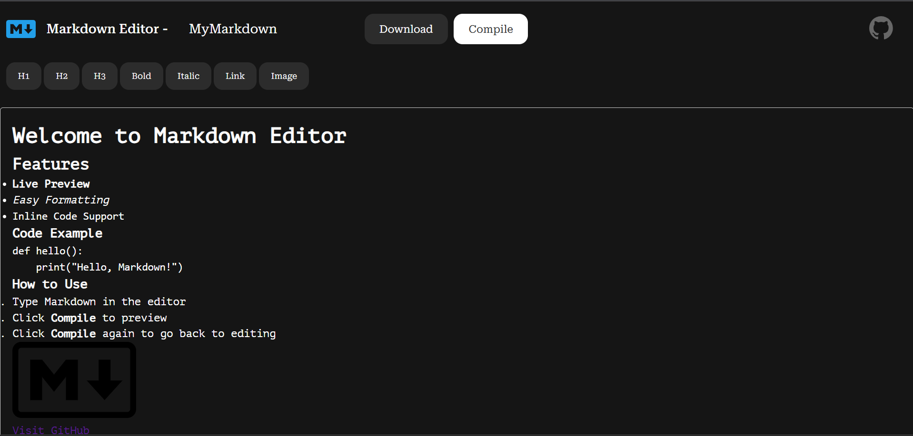

  
# Markdown Editor

### [OPEN EDITOR](https://rakeshkanna-rk.github.io/Markdown-Editor/)

This Markdown Editor is a web-based tool designed for an intuitive writing and previewing experience with Markdown documents. Markdown is a lightweight markup language with plain-text formatting syntax, commonly used for README files, documentation, and text-based content.

## Features

- **Syntax Highlighting**: Uses CodeMirror for Markdown syntax highlighting, making it easier to read and edit.
- **Live Preview**: Instantly see the rendered HTML output of your Markdown text while typing.
- **Download Markdown File**: Save your Markdown document as a file with a custom filename.
- **Toolbar Shortcuts**: Quick access buttons for adding headings, italic, links, and images.
- **Toggle Preview Mode**: Switch between editing and preview modes seamlessly.

## Usage

1. **Writing Markdown**: Type in the editor section with real-time syntax highlighting.
2. **Preview**: Click the **Compile** button to toggle between editing and preview mode.
3. **Download Markdown**: Enter a filename in the input field and click **Download** to save your Markdown file.

## Screenshots

## Contributor Guide

We welcome community contributions to enhance the Markdown Editor. To contribute:

1. Fork the repository.
2. Create a new branch: `git checkout -b feature-name`.
3. Implement your changes and commit: `git commit -m 'Add new feature'`.
4. Push to the branch: `git push origin feature-name`.
5. Submit a pull request detailing your changes.

## Credits

This Markdown Editor was created by [Rakesh Kanna](https://github.com/rakeshkanna-rk). You can find the source code and contribute to the project on [GitHub](https://github.com/rakeshkanna-rk/Markdown-Editor).

### PROJECT LICENSED UNDER [MIT LICENSE](LICENSE)

### [OPEN EDITOR](https://rakeshkanna-rk.github.io/Markdown-Editor/)